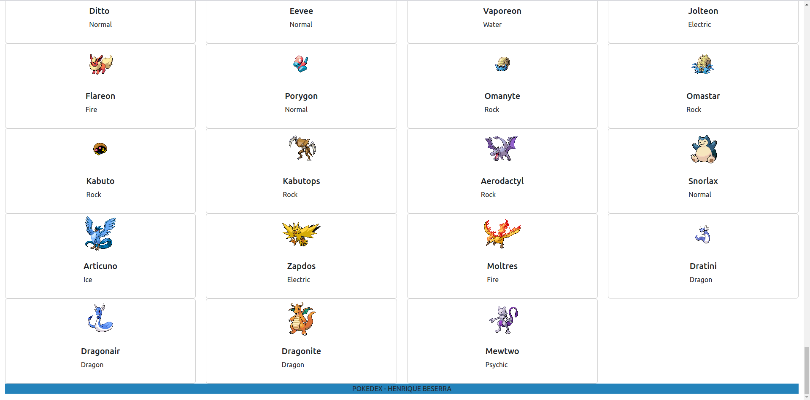

# EBAC-Workshop-Tecnology
Projeto de pokedex desenvolvido durante o workshop promovido pela e.b.a.c

O projeto consiste em consumir uma api  da - pokeapi - e alimentar uma página web desenvolvida em html, com conteúdos fornecidos pela API.

> Tecnologias ultilizadas: HTML, CSS, JAVASCRIPT
